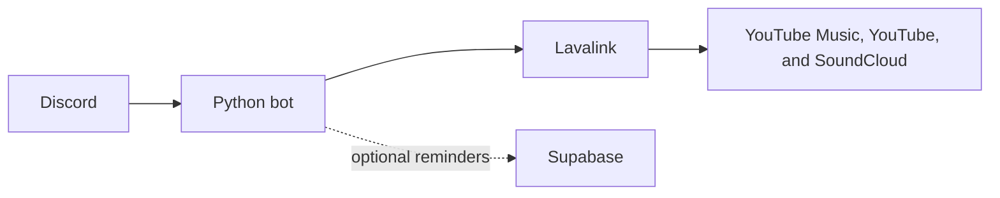

# SSJ Bot

This is the music bot I use on Discord. It lets us search for songs, play playlists, and manage the queue without leaving the voice channel.

The first version handled audio directly from Python with `yt-dlp`. Over time, I separated that responsibility: the bot now uses Wavelink to communicate with Lavalink, which handles music searches and playback. I run the whole project on my home server with Docker Compose.

I also added personal reminders backed by Supabase. This part is optional, so the music commands still work when reminders are not configured.

## What does it do?

- Searches YouTube Music, YouTube, and SoundCloud.
- Plays individual songs and playlists.
- Keeps a separate queue for each Discord server.
- Supports pausing, resuming, skipping, shuffling, and removing tracks.
- Shows the current song with playback controls.
- Includes shortcuts for my Dragon Ball Z and anime playlists.
- Can create, list, and cancel personal reminders.
- Runs with separate Docker containers for the bot and Lavalink.

## How it works



Python handles the commands, queues, and messages shown in Discord. Lavalink handles audio and connects to the bot through Wavelink.

## Commands

### Music

| Command | What it does |
|---|---|
| `/play <search or URL>` | Plays a song or adds it to the queue. It also accepts playlists. |
| `/search <query>` | Shows up to five results to choose from. |
| `/nowplaying` | Shows the current song and its controls. |
| `/queue` | Shows the playback queue. |
| `/skip` | Skips the current song. |
| `/pause` | Pauses playback. |
| `/resume` | Resumes playback. |
| `/shuffle` | Shuffles the queue. |
| `/remove <position>` | Removes a song from the queue. |
| `/volume <0-100>` | Changes the volume. |
| `/stop` | Clears the queue and disconnects the bot. |
| `/dbz` | Adds my Dragon Ball Z playlist. |
| `/anime` | Adds my anime playlist. |
| `/coin` | Flips a coin. |

Commands can also be run by mentioning the bot, for example: `@SSJBot play d4vd`.

### Reminders

| Command | What it does |
|---|---|
| `/remind` | Opens a form to create a reminder. |
| `/reminders` | Shows pending reminders and lets their owner cancel them. |

Dates accept `hoy`, `mañana`, or the `dd/mm` format. Times use `hh:mm` and are interpreted in `America/Santiago`.

## Quick start with Docker

You need:

- Docker Engine with Docker Compose.
- A bot created in the [Discord Developer Portal](https://discord.com/developers/applications).
- The Message Content Intent enabled if you want to use mentions as an alternative to slash commands.

```bash
git clone https://github.com/Irenko85/ssj-bot.git
cd ssj-bot
cp .env.example .env
touch lavalink/cookies.txt
```

Edit `.env` and set at least these variables:

```dotenv
DISCORD_TOKEN=your_token
GUILD_IDS=
LAVALINK_URI=http://lavalink:2333
LAVALINK_PASSWORD=an_internal_password
LOG_LEVEL=INFO
```

`GUILD_IDS` accepts one or more comma-separated server IDs. If you leave it empty, Discord registers the commands globally and they may take up to an hour to appear.

Start both containers with:

```bash
docker compose up -d --build
docker compose logs -f
```

The `lavalink/cookies.txt` file is not committed to the repository. It can be empty, but it must exist so Docker can mount it. If YouTube starts rejecting requests, replace it with cookies exported in Netscape format or set `YOUTUBE_REFRESH_TOKEN` in `.env`.

## Optional reminders

To enable reminders, also set:

```dotenv
SUPABASE_URL=https://your-project.supabase.co
SUPABASE_KEY=your-anon-key
REMINDERS_CHANNEL_ID=123456789012345678
REMINDER_USER_YO_ID=111111111111111111
REMINDER_USER_ELLA_ID=222222222222222222
```

The user IDs correspond to the `yo` and `ella` options in the reminder form. Reminders are stored in a Supabase `reminders` table so they can be recovered after the bot restarts.

If the Supabase or channel variables are missing, the reminder module is disabled and the music commands remain available.

## Local development

Python 3.12 or newer is required. Create a virtual environment to work on the code and run the tests:

```bash
python -m venv .venv
source .venv/bin/activate
python -m pip install -r requirements.txt
python -m pip install -r requirements-dev.txt
```

Run the test suite with:

```bash
.venv/bin/python -m pytest tests/ -v
```

To test the complete bot, including Lavalink, run `docker compose up -d --build`.

## Project structure

```text
.
├── bot.py                    # Bot startup and Lavalink connection
├── cogs/
│   ├── music_cog.py          # Music playback, queues, and commands
│   └── reminders_cog.py      # Reminder creation and delivery
├── utils/
│   ├── reminders_store.py    # Supabase reminder persistence
│   └── ui.py                 # Discord embeds, buttons, and views
├── lavalink/
│   └── application.yml       # Audio server configuration
├── tests/                    # pytest test suite
├── Dockerfile
└── docker-compose.yml
```

## Updating the server

The source code is copied into the bot image, so `docker compose restart` does not apply new changes. Rebuild the image when updating the deployment:

```bash
git pull
docker compose up -d --build
```
