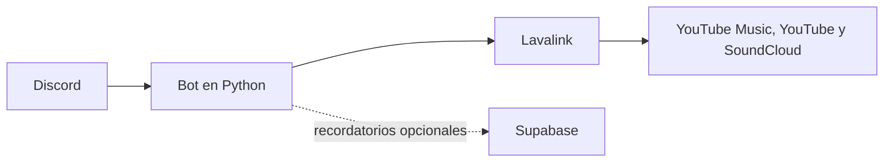

# SSJ Bot

Este es el bot de música que uso en Discord. Permite buscar canciones, reproducir playlists y controlar la cola sin tener que salir del canal.

La primera versión reproducía el audio directamente desde Python con `yt-dlp`. Con el tiempo separé esa parte y ahora el bot usa Wavelink para comunicarse con Lavalink, que se encarga de buscar y reproducir el audio. Todo se ejecuta con Docker Compose en mi servidor.

Además de la música, agregué recordatorios personales que se guardan en Supabase. Esa función es opcional: si no se configura, el resto del bot sigue funcionando normalmente.

## ¿Qué hace?

- Busca música en YouTube Music, YouTube y SoundCloud.
- Reproduce canciones y playlists.
- Mantiene una cola independiente en cada servidor de Discord.
- Permite pausar, continuar, saltar, mezclar y quitar canciones de la cola.
- Muestra la canción actual con botones para controlar la reproducción.
- Incluye playlists rápidas de Dragon Ball Z y anime.
- Puede crear, listar y cancelar recordatorios personales.
- Se ejecuta con Docker usando un contenedor para el bot y otro para Lavalink.

## Cómo funciona



Python maneja los comandos, las colas y los mensajes que aparecen en Discord. Lavalink se encarga del audio y se conecta al bot mediante Wavelink.

## Comandos

### Música

| Comando | Para qué sirve |
|---|---|
| `/play <búsqueda o URL>` | Reproduce una canción o la agrega a la cola. También acepta playlists. |
| `/search <búsqueda>` | Muestra hasta cinco resultados para elegir. |
| `/nowplaying` | Muestra la canción actual y sus controles. |
| `/queue` | Muestra la cola de reproducción. |
| `/skip` | Salta la canción actual. |
| `/pause` | Pausa la reproducción. |
| `/resume` | Continúa la reproducción. |
| `/shuffle` | Mezcla la cola. |
| `/remove <posición>` | Quita una canción de la cola. |
| `/volume <0-100>` | Cambia el volumen. |
| `/stop` | Vacía la cola y desconecta el bot. |
| `/dbz` | Agrega mi playlist de Dragon Ball Z. |
| `/anime` | Agrega mi playlist de anime. |
| `/coin` | Lanza una moneda. |

Los comandos también se pueden ejecutar mencionando al bot, por ejemplo: `@SSJBot play d4vd`.

### Recordatorios

| Comando | Para qué sirve |
|---|---|
| `/remind` | Abre un formulario para crear un recordatorio. |
| `/reminders` | Muestra los recordatorios pendientes y permite cancelarlos. |

Las fechas aceptan `hoy`, `mañana` o el formato `dd/mm`. Las horas usan el formato `hh:mm` y se interpretan en `America/Santiago`.

## Inicio rápido con Docker

Necesitas:

- Docker Engine con Docker Compose.
- Un bot creado en el [Discord Developer Portal](https://discord.com/developers/applications).
- El intent de contenido de mensajes habilitado para poder usar las menciones como alternativa a los slash commands.

```bash
git clone https://github.com/Irenko85/ssj-bot.git
cd ssj-bot
cp .env.example .env
touch lavalink/cookies.txt
```

Edita `.env` y agrega al menos estas variables:

```dotenv
DISCORD_TOKEN=tu_token
GUILD_IDS=
LAVALINK_URI=http://lavalink:2333
LAVALINK_PASSWORD=una_contraseña_interna
LOG_LEVEL=INFO
```

`GUILD_IDS` acepta uno o más IDs separados por comas. Si lo dejas vacío, Discord registra los comandos globalmente y pueden tardar hasta una hora en aparecer.

Después puedes levantar ambos contenedores con:

```bash
docker compose up -d --build
docker compose logs -f
```

El archivo `lavalink/cookies.txt` no se sube al repositorio. Puede quedar vacío, pero debe existir para que Docker pueda montarlo. Si YouTube comienza a rechazar solicitudes, puedes reemplazarlo por cookies exportadas en formato Netscape o configurar `YOUTUBE_REFRESH_TOKEN` en `.env`.

## Recordatorios opcionales

Para activar los recordatorios también debes configurar:

```dotenv
SUPABASE_URL=https://tu-proyecto.supabase.co
SUPABASE_KEY=tu-anon-key
REMINDERS_CHANNEL_ID=123456789012345678
REMINDER_USER_YO_ID=111111111111111111
REMINDER_USER_ELLA_ID=222222222222222222
```

Los IDs de usuario corresponden a las opciones `yo` y `ella` del formulario. Los recordatorios se guardan en una tabla `reminders` de Supabase para poder recuperarlos después de reiniciar el bot.

Si faltan las variables de Supabase o el canal, el módulo se desactiva y los comandos de música siguen disponibles.

## Desarrollo local

Se necesita Python 3.12 o una versión más reciente. Para trabajar en el código y ejecutar las pruebas puedes crear un entorno virtual:

```bash
python -m venv .venv
source .venv/bin/activate
python -m pip install -r requirements.txt
python -m pip install -r requirements-dev.txt
```

Para ejecutar las pruebas:

```bash
.venv/bin/python -m pytest tests/ -v
```

Para probar el bot completo, incluyendo Lavalink, usa `docker compose up -d --build`.

## Estructura del proyecto

```text
.
├── bot.py                    # Inicio del bot y conexión con Lavalink
├── cogs/
│   ├── music_cog.py          # Reproducción, colas y comandos de música
│   └── reminders_cog.py      # Creación y entrega de recordatorios
├── utils/
│   ├── reminders_store.py    # Persistencia de recordatorios en Supabase
│   └── ui.py                 # Embeds, botones y vistas de Discord
├── lavalink/
│   └── application.yml       # Configuración del servidor de audio
├── tests/                    # Pruebas con pytest
├── Dockerfile
└── docker-compose.yml
```

## Actualización en el servidor

El código queda dentro de la imagen del bot, por lo que un `docker compose restart` no aplica los cambios nuevos. Para actualizarlo hay que reconstruir la imagen:

```bash
git pull
docker compose up -d --build
```
